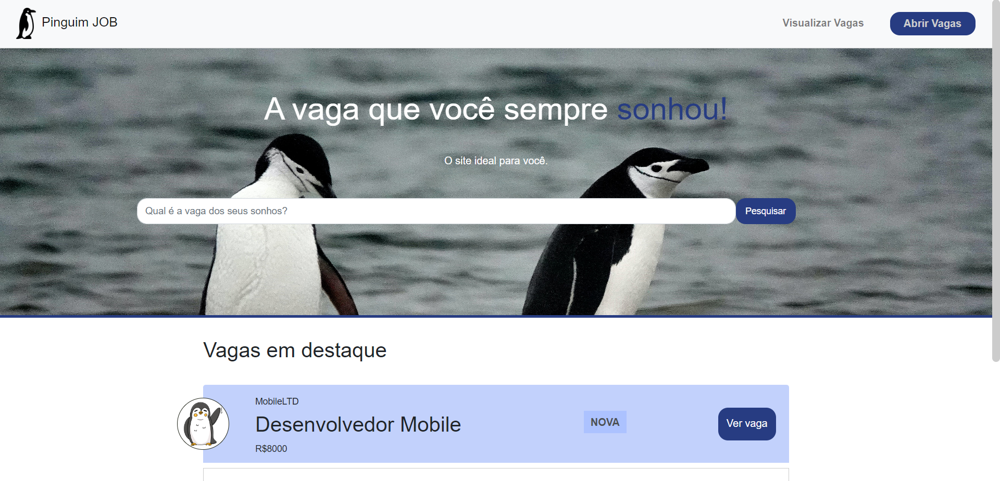
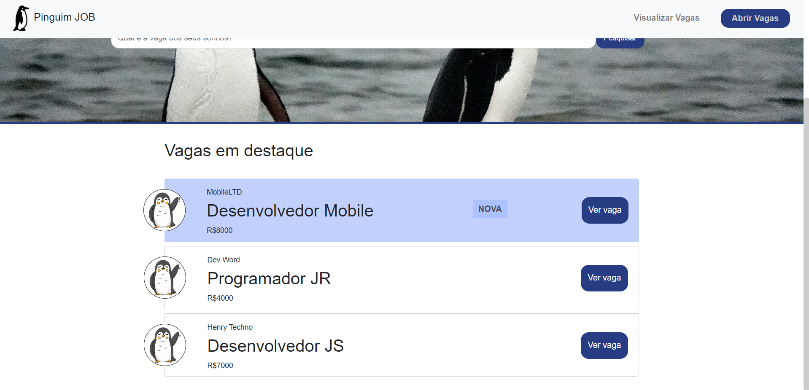
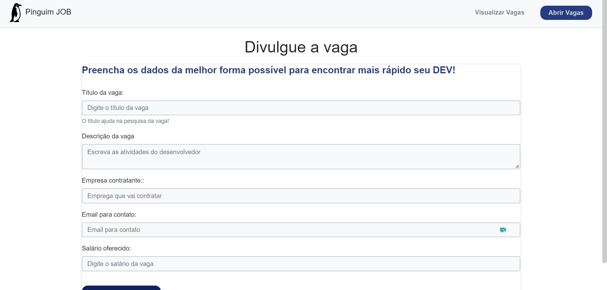
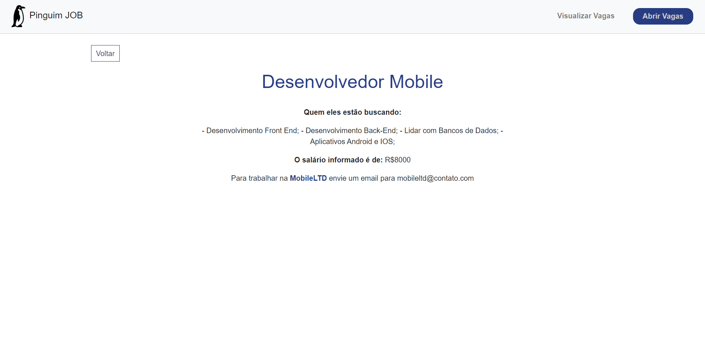

<h1 align="center"> 🐧 { Pinguim JOB }  🐧 </h1>

 Site ideal para você, desenvolvedor, que busca sua vaga dos sonhos!

 <a href="#recursos">Recursos</a> •
  <a href="#objetivo">Objetivo</a> •
 <a href="#tecnologias">Tecnologias</a> • 
 <a href="#status">Status</a> • 
 <a href=#imagens"> Imagens </a> • 

### Status

<h4 align="center"> 
	🎯 🚀 Projeto Concluído! 🎯
</h4>

### Pré-requisitos

Para rodar na máquina, é necessário as seguintes ferramentas: 
[Git](https://git-scm.com), [Node JS](https://nodejs.org/en/), [Express] (http://expressjs.com/pt-br/), 
Como também um excelente editor de códigos:  [VSCode](https://code.visualstudio.com/)

### Recursos

- [x] Campo de pesquisar otimizado;
- [x] Página de abrir vagas com formulário;
- [x] Button de "Ver Vaga" que abre as informações sobre a vaga;

### 🛠 Tecnologias

As seguintes ferramentas foram usadas na construção do projeto:

- [Node JS](https://nodejs.org/en/)
- [HandleBars](https://handlebarsjs.com/)
- [BootStrap](https://getbootstrap.com/)
- [Postman](https://www.postman.com/)
- [Express](http://expressjs.com/pt-br/)
- [CSS3]

### Objetivo

 
Desenvolver o site ideal para quem deseja buscar a vaga dos seus sonhos ou divulgar empregos!

### Imagens

<h2 align="center"> Home </h2>

 A página Home do projeto! Inicia com imagens e informações para guiar o usuário em uma experiência agradável! 🧠

		 

		 
		 
		 

<h2 align="center"> Abrir Vagas </h2>

 A página tem a finalidade de fornecer as empresas a possibilidade de divulgar suas vagas! 

		 
		 

<h2 align="center"> Ver vagas </h2>

 Clicando no buttom "Ver vagas" você é redirecionado a essa página que contém as informações sobre a vaga! 

		 

		  
